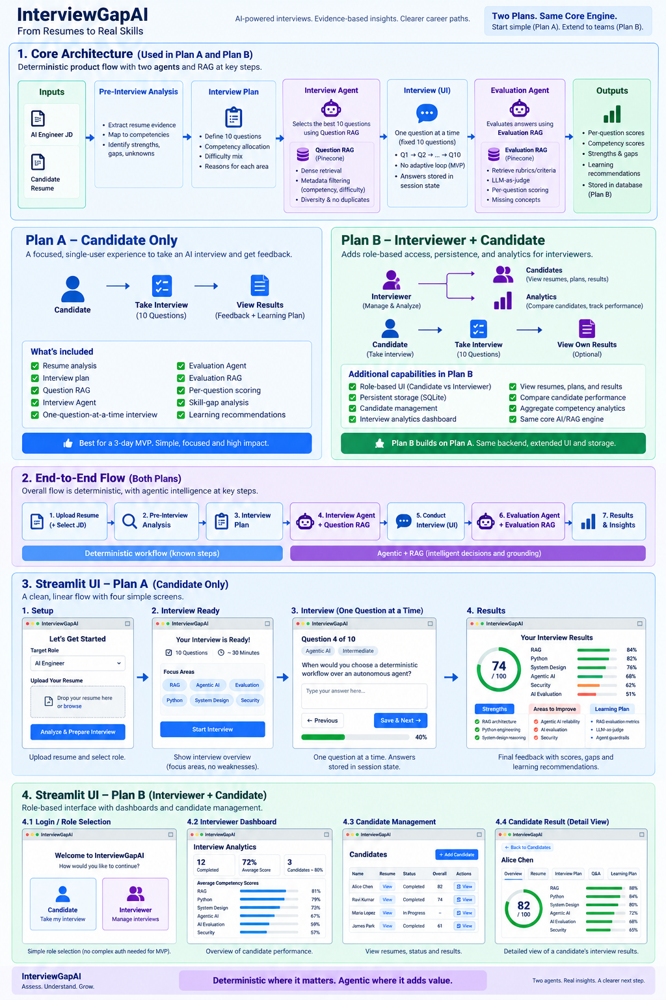

# InterviewGapAI

InterviewGapAI turns a candidate's resume into a tailored AI-engineering interview. It analyzes resume evidence, prepares and retrieves 10 curated questions, evaluates the submitted answers, and produces an explainable competency scorecard with learning recommendations.

## Architecture



The system uses LLMs for resume interpretation, interview planning, and grounded answer assessment. Deterministic application rules validate every stage, retrieve approved questions, calculate scores, and select curated learning resources.

## Run locally

### Prerequisites

- Python 3.10 or later
- [uv](https://docs.astral.sh/uv/getting-started/installation/)
- OpenAI and Pinecone API keys
- A populated Pinecone index using the configured question and evaluation namespaces

On macOS, install uv with:

```bash
brew install uv
```

### 1. Configure the environment

From the repository root:

```bash
cp .env.example .env
```

Add your secrets to `.env` and confirm the Pinecone settings:

```dotenv
OPENAI_API_KEY=your-openai-api-key
PINECONE_API_KEY=your-pinecone-api-key
PINECONE_INDEX_NAME=interviewgap-ai
PINECONE_QUESTION_NAMESPACE=questions-v1
PINECONE_EVALUATION_NAMESPACE=evaluation-v1
```

`.env` is Git-ignored and must not be committed.

### 2. Install dependencies

```bash
uv sync --locked
```

### 3. Start the application

```bash
uv run streamlit run ui/app.py
```

Streamlit normally opens the application automatically. Otherwise, visit [http://localhost:8501](http://localhost:8501).

## Reviewer walkthrough

### Candidate flow

1. Upload a PDF, DOCX, DOC, CSV, MD, or MARKDOWN resume, up to 10 MB.
2. Review the generated 10-question interview plan.
3. Start the interview and answer or skip each question.
4. Submit the full interview; evaluation runs only after final submission.
5. Review the overall score, competency strengths, gaps, and recommended learning resources.

Questions are shown one at a time. Rubrics and question-level scores remain hidden during the interview.

### Interviewer flow

To review intake traces, evaluation evidence, reports, and runtime configuration, set credentials in `.env`:

```dotenv
INTERVIEWER_USERNAME=admin
INTERVIEWER_PASSWORD=choose-a-local-password
```

Restart the application, select **Interviewer sign in** from the upload screen, and use the configured credentials.

## Run the automated tests

```bash
uv run --locked pytest
```

The tests run offline and cover both the backend and Streamlit UI boundaries. Live OpenAI and Pinecone calls are exercised through the application, not the default test suite.

## Reviewer references

- [Evaluation Agent interface](docs/EVALUATION_AGENT_INTERFACE.md)
- [Evaluation RAG interface](docs/EVALUATION_RAG_INTERFACE.md)
- [Observability and trace guide](docs/OBSERVABILITY.md)
- [MVP implementation guide](docs/FIVE_DAY_MVP_IMPLEMENTATION_GUIDE.md)
