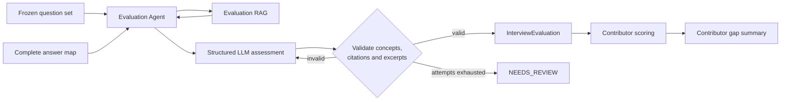

# Evaluation Agent interface

The Evaluation Agent is the post-submission boundary between the candidate
interview and contributor-owned scoring and gap reporting. It produces grounded,
validated concept judgements; it does not calculate scores or skill gaps.



## Application entry point

```python
from src.evaluation import evaluate_interview_answers

evaluation = evaluate_interview_answers(
    question_set=frozen_question_set,
    answers={
        "RAG-INT-001": "The candidate's complete answer...",
        "AGENT-BAS-001": "",
    },
)
```

The answer keys must exactly match the frozen question IDs. An empty string is
an explicit skip. Evaluation starts only after the UI has collected the complete
answer set.

`InterviewEvaluation.questions` preserves interview order. Every item terminates
as one of:

| Status | Meaning | Downstream scoring behavior |
| --- | --- | --- |
| `EVALUATED` | Concept judgements passed all application validation | Score from concept statuses |
| `SKIPPED` | Candidate submitted no answer | Apply the contributor's explicit-skip policy |
| `NEEDS_REVIEW` | Evidence, provider, or structured output was unusable | Leave unscored; never convert a technical failure to zero |

An evaluated item contains exact must-have concept text, `DEMONSTRATED`,
`PARTIAL`, or `MISSING` status, a concise rationale, answer excerpt, evidence IDs,
confidence, and retrieval provenance. It intentionally contains no `score`,
competency average, gap, or recommendation field.

## Guardrails and stopping conditions

The agent accepts a model assessment only when:

1. Every curated must-have concept appears exactly once.
2. Every cited evaluation ID came from the supplied Evaluation RAG result.
3. Every claimed answer excerpt occurs verbatim in the submitted answer.
4. `DEMONSTRATED` and `PARTIAL` judgements include a supporting excerpt.
5. Semantic retrieval recovered at least one of the question's curated
   `evaluation_refs`.

Invalid output receives bounded correction feedback. Exhausted attempts become
`NEEDS_REVIEW`; they do not become a candidate score. Candidate answers and
retrieved documents are explicitly packaged as untrusted data in the system
prompt.

Retrieval/model failures are isolated per question. The other submitted answers
can still reach terminal states, allowing a downstream report to disclose partial
coverage rather than losing the complete interview.

## Dependency injection

Tests or alternate hosts can inject both external boundaries:

```python
from src.evaluation import EvaluationAgent

agent = EvaluationAgent(
    retrieve_context=my_evaluation_rag_adapter,
    assessor=my_structured_assessor,
    max_attempts=3,
    max_workers=4,
)
```

The default retrieval dependency is the existing
`retrieve_evaluation_context(question, candidate_answer, competency)` service.
The default assessor uses the shared OpenAI-compatible provider and retry policy.

Configuration follows the repository's existing provider settings:

| Variable | Default |
| --- | --- |
| `LLM_PROVIDER` | `openai` |
| `EVALUATION_AGENT_MODEL` | Selected provider's default model |
| `EVALUATION_AGENT_MAX_ATTEMPTS` | `3` |
| `EVALUATION_AGENT_MAX_WORKERS` | `4` |

Evaluation RAG still requires its documented OpenAI embedding and Pinecone
configuration. Four workers bound post-submission latency while avoiding ten
simultaneous model and vector-service calls by default.

## Offline verification

```bash
uv run pytest -q tests/test_evaluation_agent.py ui/tests/test_gateway.py
```

These tests inject retrieval and assessment fakes; they do not spend provider
tokens or require Pinecone.

## Live smoke test

After ingesting the evaluation corpus into `evaluation-v1`, run one existing
question and a concrete answer through both Evaluation RAG and the agent:

```bash
uv run python -m scripts.run_evaluation_agent_smoke
```

The command prints the exact question, expected concepts and candidate answer,
followed by the validated `QuestionEvaluation`. Override the answer without
editing code:

```bash
uv run python -m scripts.run_evaluation_agent_smoke \
  --answer "Query is what the current token is looking for."
```

This is a live integration test. It reads Pinecone and spends one embedding call
plus at least one structured LLM assessment call. It does not upsert or otherwise
modify the index.
