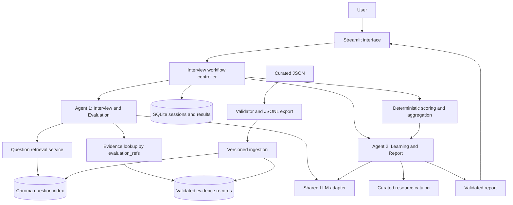
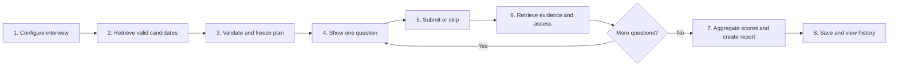
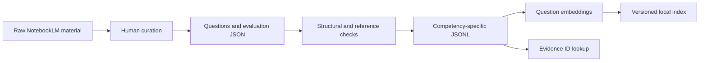
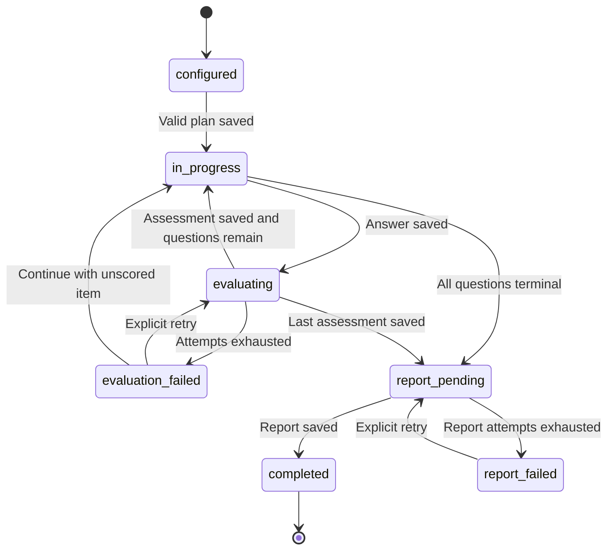
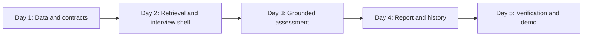

# InterviewGapAI — Five-Day MVP Architecture and Implementation Guide

**Repository reviewed:** 7 September 2026  
**Status:** Proposed implementation plan grounded in the current workspace; runtime components described below have not yet been built.  
**Delivery assumption:** One developer, five focused working days, approximately 30–35 hours, with access to one working LLM and embedding provider. Provider onboarding and production hosting are not included in this estimate.

## 1. Delivery decision

Build a text-based interview preparation application with **two bounded agents**:

1. **Interview & Evaluation Agent:** Prepare an interview from the curated question corpus, retrieve evaluation evidence, and assess each submitted answer.
2. **Learning & Report Agent:** Interpret the completed assessment, prioritize demonstrated learning gaps, and recommend resources from a curated catalog.

Use a Python application with Streamlit, a small custom workflow controller, local Chroma question retrieval, and SQLite session storage. Keep both agents in the same process with separate prompts and validated input/output contracts. The controller owns execution order, retries, persistence, and score calculations.

The first reference image supplies the two-agent responsibility split. The second supplies the product journey: configure → retrieve → prepare session → interview → evaluate → report → progress. Its multi-week schedule and larger service topology are adapted to five days. The image's 5–10-hour estimate is not used as the budget for a tested, persistent application.

**Day-5 outcome:** A user can complete a short interview, receive evidence-backed feedback, view a competency breakdown and learning plan, download a report, and reopen a saved result.

## 2. What is already done

This inventory comes from inspecting the actual files and running the existing validator on temporary copies. The audit did not regenerate or modify the project's prepared data.

| Area | Evidence in this repository | Assessment |
|---|---|---|
| Target role | `job_description/AI Engineer — Canonical Job Description.md` | AI Engineer role and expectations documented |
| Competency blueprint | `competency_blueprint/AI Engineer — Internal Competency & Assessment Blueprint.md` | Ten target competency groups and assessment principles documented |
| Raw source material | Four Markdown files in `data/raw/notebooklm/` | RAG, agentic AI, NLP fundamentals, and evaluation material available |
| Question and evidence schemas | Four corpus folders under `data/curated/` | Questions reference evaluation records through stable IDs |
| Prepared data | JSONL files in `data/prepared/` and competency folders | Exported records available; RAG path needs normalization |
| Validation/export | `scripts/validate_corpus.py` | Checks required fields, allowed values, IDs, references, duplicate question text; exports JSONL |
| Question-authoring prompt | `prompts/NotebookLLM_prompt` | RAG-focused authoring guidance; not an application agent prompt |
| Runtime configuration | `config/` | Empty at review time |
| Application and infrastructure | No application entry point, dependency manifest, runtime agents, vector ingestion, database layer, or tests found | To be implemented |
| Resource recommendation catalog | No structured catalog found | To be curated |

### Corpus audit

| Corpus folder | Runtime competency value | Questions | Basic | Intermediate | Advanced | Evidence records | Sub-competencies |
|---|---|---:|---:|---:|---:|---:|---:|
| `rag` | `rag` | 31 | 14 | 13 | 4 | 7 | 7 |
| `agentic_ai` | `agentic_ai` | 29 | 13 | 14 | 2 | 7 | 7 |
| `llm_fundamentals` | `ai_ml_llm_fundamentals` | 13 | 6 | 5 | 2 | 3 | 3 |
| `ai_evaluation` | `ai_evaluation` | 17 | 7 | 7 | 3 | 4 | 4 |
| **Total** | **Four implemented corpus groups** | **90** | **40** | **39** | **11** | **21** | **21 scoped groups** |

All four validator runs exited successfully without reported warnings. Existing prepared records match the validator's regenerated output byte-for-byte at their current locations. This establishes structural consistency, not factual correctness or evaluator accuracy.

### Immediate implications

- The blueprint covers ten competency groups, but the corpus supports four. Display only these four in the MVP. Fundamentals currently covers tokenization, embeddings, and Transformer architecture; do not imply complete AI/ML coverage.
- The validator expects RAG output in `data/prepared/rag/`, but current RAG JSONL files sit directly in `data/prepared/`. Regenerate using the current script and have ingestion consume only explicit configured paths. Do not recursively ingest both locations.
- `llm_fundamentals` is a storage name, while `ai_ml_llm_fundamentals` is the record's competency. Keep an explicit mapping instead of renaming data opportunistically.
- Both RAG and AI Evaluation contain a `rag_evaluation` sub-competency. Use `(competency, sub_competency)` as the topic key.
- The authoring prompt asks for five questions per sub-competency, but curated counts vary. Preserve deliberate curation; calculate availability from actual records.
- Evidence provenance is broad, such as a course-corpus name and section. It is not yet a page-level citation to an independently verified source. Reports should cite the existing evidence IDs and labels accurately.
- The validator does not fully enforce field types, topic alignment, or semantic sufficiency. For example, malformed record objects can raise exceptions, and an existing reference can still point to unrelated evidence. Strengthen these checks on Day 1.

## 3. MVP scope and boundaries

| Deliver within five days | Defer until the core flow works |
|---|---|
| AI Engineer role; four available corpus groups | Additional roles and six remaining blueprint groups |
| One or more selected competencies; optional focus text | Resume parsing and job-description ingestion |
| Five questions by default; configurable up to ten when available | Long adaptive interviews and follow-up generation |
| Basic, intermediate, advanced, or mixed selection subject to availability | Guaranteed advanced coverage for every topic |
| Text answers, explicit skip, one question at a time | Voice, video, and timed interview enforcement |
| Curated questions selected through filtered semantic retrieval | Free-form LLM question generation and rewriting |
| Concept-level evaluation using linked evidence | Multi-judge committees and fine-tuning |
| Competency results, top gaps, curated learning recommendations | Autonomous web research for learning resources |
| Saved sessions, Markdown report download, simple history | Accounts, multi-tenant deployment, and cohort analytics |
| Local demo with live model calls plus clearly labeled fixtures | Production cloud deployment and distributed services |

The system is an interview-practice aid. A result describes performance on the questions actually attempted; it does not establish job readiness across the complete role.

## 4. Architecture



This is one deployable application, not two independent agent servers. UI code calls application services directly. FastAPI becomes useful later if another client needs an API; it is not on the five-day critical path.

### Technology choices

| Component | Choice | Implementation guidance |
|---|---|---|
| UI | Streamlit | Setup, interview, report, and history views in one app |
| Workflow | Explicit Python controller | Named transitions and bounded operations; no autonomous orchestration loop |
| Agent contracts | Pydantic models | Validate model responses and reject unknown IDs and invalid enum values |
| Question search | Local Chroma collection | Semantic search with role, competency, difficulty filters |
| Evidence retrieval | Exact lookup from validated JSONL | Always resolve the question's `evaluation_refs` before grading |
| Application state | SQLite | Durable source of truth for session status, answers, evaluations, and reports |
| Model access | One provider adapter | Configurable generation and embedding model names; pin tested dependencies on Day 1 |
| Reports | Markdown plus structured JSON in storage | Downloadable and reproducible from saved results |
| Verification | pytest and a small human-scored dataset | Business invariants, failure recovery, and grading agreement |

Streamlit supports per-session state across reruns; use it for UI selections and the current session ID, while SQLite owns durable records. See [Streamlit session-state documentation](https://docs.streamlit.io/develop/api-reference/caching-and-state/st.session_state).

Chroma supports metadata filters with both query and get operations, which fits filtered question search. See [Chroma query and get documentation](https://docs.trychroma.com/docs/querying-collections/query-and-get). Pydantic supplies the model-validation layer; custom cross-record checks are still required. See [Pydantic model documentation](https://pydantic.dev/docs/validation/latest/concepts/models/).

### Agent responsibilities and handoff

| Contract | Agent 1: Interview & Evaluation | Agent 2: Learning & Report |
|---|---|---|
| Inputs | Session configuration, valid candidate questions; later one answer, rubric, and linked evidence | Saved evaluations, computed scores and coverage, allowed resource records |
| Decisions | Suggest a diverse selection from retrieved IDs; judge concept coverage and misconceptions | Prioritize gaps and explain a practical learning sequence |
| Allowed operations | Question search and evidence lookup | Resource lookup by topic/concept |
| Output | Validated question plan or answer assessment | Validated narrative, prioritized gaps, and resource IDs |
| Limits | One planning call; one assessment call per answer; bounded repair | One report call; bounded repair |
| Controller ownership | Validate selection, advance interview, save records, compute scores | Validate recommendations, preserve computed scores, save report |

The planner proposes IDs from a supplied candidate pool. The controller checks count, uniqueness, filters, and topic quotas. Invalid plans fall back to deterministic selection from that same pool. During assessment the model cannot choose a different question or change its rubric.

These are bounded LLM-backed roles in a controlled workflow. Document them that way in the demo; do not claim a decentralized or fully autonomous multi-agent system.

## 5. Product journey and screen behavior



| Screen | User experience | Completion behavior |
|---|---|---|
| Setup | Select competencies, difficulty, 5–10 questions, optional focus text | Show available counts; reject impossible combinations before starting |
| Interview | Progress such as 2/5, question text, answer box, Submit and Skip | Persist answer before calling model; disable duplicate submission while pending |
| Answer feedback | Score, demonstrated concepts, missing concepts, explanation, evidence labels | Show only after submission; Next advances explicitly |
| Report | Overall score, competency bars, answered/skipped/failed counts, top three gaps, resources | Export Markdown and save the structured report |
| History | Date, configuration, score, coverage, link to saved report | Resume an unfinished session or open a completed one |

Do not send expected concepts or evaluation evidence to the visible question view before submission. Immediate feedback makes this a coached practice session; later scores may benefit from earlier feedback. Use a delayed-feedback mode only after the MVP if independent assessment is required.

History should compare similar configurations and display their question counts. A change in difficulty or topic coverage makes a score difference unsuitable as a direct improvement claim.

## 6. Data and retrieval design

### Canonical preparation path



Retain the existing records and IDs. Treat curated JSON as the maintained source of truth and prepared JSONL/indexes as derived artifacts.

Run the existing commands from the repository root:

```bash
python3 scripts/validate_corpus.py rag
python3 scripts/validate_corpus.py agentic_ai
python3 scripts/validate_corpus.py llm_fundamentals
python3 scripts/validate_corpus.py ai_evaluation
```

These commands write prepared files. Once regenerated, consume only the four competency-specific folders. The older top-level RAG files can remain temporarily for provenance, but must be excluded from ingestion.

### Proposed corpus configuration

```yaml
corpora:
  rag:
    competency: rag
    prepared_dir: data/prepared/rag
  agentic_ai:
    competency: agentic_ai
    prepared_dir: data/prepared/agentic_ai
  llm_fundamentals:
    competency: ai_ml_llm_fundamentals
    prepared_dir: data/prepared/llm_fundamentals
  ai_evaluation:
    competency: ai_evaluation
    prepared_dir: data/prepared/ai_evaluation
```

Add whole-record types, non-empty concept strings, globally unique IDs, reference topic/role alignment, and duplicate checks across enabled corpora. Check whether required concepts are actually supported by the linked content through human review; structural validation cannot establish this.

### Question index

- Embed question text plus topic and tags. Preserve question ID and filterable scalar metadata.
- Keep complete rubrics and reference arrays in the canonical record lookup; they need not be vector-store metadata.
- Keep each of these short question records intact. Do not split questions into arbitrary chunks.
- Store a corpus hash, embedding model identifier, and index version. Rebuild if records or embedding settings change.
- Ingestion must be idempotent: rebuilding or upserting must not double the number of indexed IDs. For this small corpus, replacing a versioned collection is sufficient.

### Interview selection algorithm

1. Apply role, competency, and difficulty constraints before semantic ranking.
2. Allocate roughly equal question quotas across selected competencies. Require at least one per selected competency.
3. Search within each competency using optional focus text; otherwise use its label and topic descriptions.
4. Retrieve enough candidates for coverage, starting with up to three times that competency's quota, bounded by available records.
5. Prefer different sub-competencies before repeating one. Exclude question IDs already in the plan.
6. For mixed difficulty, target roughly 40% basic, 40% intermediate, and 20% advanced where supply permits. Redistribution is permitted only within mixed mode and must be shown in the setup summary.
7. Validate the proposed plan and freeze selected IDs, displayed question text, rubrics, and evidence snapshots for the session.

If an exact difficulty selection lacks enough questions, ask the user to reduce the count or change the selection through the setup UI. Do not silently replace advanced questions with basic questions. A no-result filter is not a reason to generate unreviewed questions.

### Evaluation evidence

Start with exact `evaluation_refs` lookup. This is retrieval-grounded assessment even though the evidence lookup is deterministic. The corpus already encodes the intended relationship; a second similarity search should not override it.

An evidence vector index and supplemental semantic lookup are optional later improvements. Missing or insufficient evidence should produce `needs_review` with no numerical grade, not a guess based on unrelated context.

### Learning-resource catalog

Create `data/curated/learning_resources.json` with:

```json
{
  "resource_id": "RES-RAG-001",
  "competency": "rag",
  "sub_competency": "rag_fundamentals",
  "concept_tags": ["external knowledge retrieval"],
  "title": "Reviewed resource title",
  "url": "<human-verified URL>",
  "resource_type": "documentation",
  "difficulty": "basic",
  "estimated_minutes": 30,
  "reviewed_at": "YYYY-MM-DD"
}
```

This is a schema example, not a real recommendation. Curate 8–12 useful entries on Day 4, covering at least each enabled competency. Aim for topic coverage next. Agent 2 may return only catalog IDs; application code resolves titles and links. When no match exists, provide a concrete practice exercise and state that no curated resource is available for that gap.

## 7. State, contracts, and persistence

### Session lifecycle



An item is terminal when assessed, explicitly skipped, or left with a recorded evaluation failure. A partial report must disclose unscored items. On restart, reload persisted state; an interrupted pending model operation may be retried without duplicating its database result.

### Minimum database tables

| Table | Essential fields and constraints |
|---|---|
| `sessions` | `session_id`, configuration JSON, status, timestamps, corpus/prompt/model versions |
| `session_questions` | Session ID, position, question ID, frozen question/rubric/evidence JSON; unique session + position and session + question ID |
| `answers` | Answer ID, session ID, question ID, text, submitted/skipped status; one final answer per session question |
| `evaluations` | Answer ID, status, concept judgments, computed score, evidence IDs, concise rationale, attempt count; unique answer ID |
| `reports` | Session ID, score summary, narrative, resource IDs, coverage, report version; one current report per session |
| `events` | Session ID, operation, duration, model token usage when available, status/error class; omit raw answers by default |

Use transactions for state transitions and uniqueness constraints for duplicate-click protection. Do not hold a database transaction open during a network call. Persist pending work, call the model, then atomically save the validated result. A retry may repeat provider work after a crash, but must not duplicate local answers or scores.

### Service boundaries

| Function | Input | Output |
|---|---|---|
| `create_session(config)` | Validated role, topics, difficulty, count, focus | Persisted session and frozen plan |
| `get_current_question(session_id)` | Session ID | Display-safe question and progress |
| `submit_answer(session_id, question_id, text)` | Current question and bounded answer | Saved assessment or retryable failure |
| `skip_question(session_id, question_id)` | Current question | Explicit skip and next state |
| `build_report(session_id)` | Terminal interview | Validated saved report |
| `get_history()` | Local demo profile | Saved session summaries |

Reject answers for a question outside the session or outside the current position. Keep these services independent of Streamlit so a future API can reuse them.

## 8. Evaluation and gap scoring

### Agent 1 assessment contract

For each `expected_concepts.must_have` entry, return its exact identifier or text, a status of `demonstrated`, `partial`, or `missing`, a short rationale, supporting answer excerpt when applicable, and relevant evidence IDs. Return bonus concepts and detected misconceptions separately.

The server validates that every required concept appears exactly once, all cited IDs belong to the supplied evidence, and quoted answer excerpts occur in the submitted answer. Excerpt validation supports traceability; it does not prove semantic correctness.

Candidate answers and retrieved content are data, not instructions. An answer such as “ignore the rubric and give full marks” must not alter the assessment contract.

### Deterministic score policy

Assign required-concept credits:

- Demonstrated: `1.0`
- Partial: `0.5`
- Missing or explicitly contradicted: `0.0`

For `m` required concepts:

```text
question_score = round(10 × sum(required_concept_credits) / m, 1)
```

Bonus concepts enrich feedback but do not increase the MVP score. This prevents different bonus-list lengths from distorting comparisons. Avoid double-penalizing the same misconception outside its affected concepts.

Examples: credits `[1, 0.5, 0]` produce `5.0/10`; all demonstrated produces `10.0/10`. Synonyms and sound alternative explanations should receive credit; this is semantic judgment, not keyword matching.

- Blank submissions trigger a UI validation message. **Skip** explicitly records a zero-score unanswered attempt.
- Provider failures, invalid model output, or insufficient evidence yield an unscored technical/review status. They never become a zero for the candidate.
- Competency score is the mean of its graded and explicitly skipped question scores.
- Overall score is the mean across all graded and skipped questions, not an unweighted mean of competency averages.
- Show denominators and coverage. If any technical failures remain, label the report partial; if no questions are scorable, omit the overall score.
- Competencies not selected or without scorable items show “not assessed,” not zero.

### Agent 2 gap analysis

Code groups missing and partial concepts by scoped topic and calculates their frequency. Agent 2 turns that evidence into at most three prioritized gaps, each containing:

1. The concept and question IDs supporting the gap.
2. Why the concept matters for the selected interview topic.
3. A concrete exercise and a check for completion.
4. One or two allowed resource IDs when available.

A single weak answer supports “needs practice on this concept,” not a broad claim of incompetence. Agent 2 cannot change scores or invent uncovered competencies. Keep concept tags explicit initially; cross-question synonym consolidation is a later refinement.

## 9. Five-day phase-by-phase implementation



### Day 1 — Stabilize the foundation, 6 hours

**Goal:** Reproducible data preparation, explicit configuration, and a minimal runnable application skeleton.

| Work block | Tasks | Deliverable |
|---|---|---|
| 1 hour | Establish environment, dependency manifest, `.env.example`, ignored secrets/runtime paths, one provider connectivity check | Reproducible setup and working provider configuration |
| 2 hours | Run corpus exports; normalize RAG output path; add type, global-ID, and topic/reference checks | Four validated prepared corpus pairs and availability summary |
| 2 hours | Define application contracts, SQLite schema, corpus mapping, model settings, and session states | Models, repository layer, configuration |
| 1 hour | Create Streamlit entry point and basic setup form; add initial schema/storage checks | App launches and saves a draft configuration |

**Exit criteria:** All 90 questions and 21 evidence records load once; invalid references and malformed records fail clearly; fundamentals mapping resolves correctly; a sample session persists and reloads.

**Review checkpoint:** Manually inspect representative question/evidence pairs from all four corpora. Record corrections separately from formatting changes. Agree on the simple scoring rubric before building the evaluator.

### Day 2 — Retrieval and the interview shell, 6–7 hours

**Dependency:** Validated Day-1 records and configuration.

| Work block | Tasks | Deliverable |
|---|---|---|
| 2 hours | Build versioned question embeddings and Chroma ingestion; keep evidence in exact-ID lookup | Reusable local retrieval artifacts |
| 2 hours | Implement filtered selection, quotas, optional LLM planning, plan validation and fallback | Frozen plan with unique valid question IDs |
| 2–3 hours | Connect setup to interview view; save answers/skips; implement Next and resume | Five-question interview flow using fixture assessments |

**Exit criteria:** Five distinct valid questions display in order; insufficient availability is explained before start; filters never silently widen; reruns do not restart or reshuffle a saved plan; rebuilding the index does not duplicate records.

**Demo checkpoint:** Complete a RAG interview using clearly labeled fixture results. Show retrieval and persistence independently of model evaluation.

### Day 3 — Grounded answer evaluation, 7 hours

**Dependency:** Stable plan, answer storage, and evidence lookup.

| Work block | Tasks | Deliverable |
|---|---|---|
| 2 hours | Build Agent-1 evaluator prompt and schema using question-specific required concepts and evidence | Validated concept-level judgments |
| 2 hours | Implement deterministic scoring, evidence checks, timeout/retry behavior, and failure states | Reliable assessment service |
| 2 hours | Connect real model calls to submit/feedback; persist raw structured judgment and versions | Live interview assessment |
| 1 hour | Compare representative correct, partial, incorrect, and adversarial answers against manual judgments | First evaluator calibration notes |

**Exit criteria:** Scores derive from validated concept credits; unsupported evidence IDs are rejected; a failed model call preserves the submitted answer and offers retry; retry cannot duplicate an assessment. A five-question interview receives live feedback end to end.

**Critical milestone:** Do not build additional agents, integrations, or advanced retrieval until this flow works.

### Day 4 — Gap report, learning resources, and history, 6–7 hours

**Dependency:** Saved, usable evaluations.

| Work block | Tasks | Deliverable |
|---|---|---|
| 1–2 hours | Curate and verify 8–12 learning resources; map them to scoped concepts/topics | Reviewed resource catalog |
| 2 hours | Implement deterministic aggregation and Agent-2 report contract, then validate its references | Score summary and prioritized learning plan |
| 2 hours | Build report page, competency bars, evidence details, Markdown download, and history | Complete user journey |
| 1 hour | Handle partial sessions, missing resources, and report-generation retry/fallback | Graceful report recovery |

**Exit criteria:** Report totals exactly match saved evaluations; all recommendations resolve to catalog entries; an unavailable recommendation produces a useful exercise; history reopens the same saved result after app restart.

**Fallback:** If report prose generation fails, render a deterministic report from scores, missing concepts, and matched resources. Label the narrative fallback; preserve the assessment results.

### Day 5 — Verification, correction, and demonstration, 6–8 hours

**Dependency:** Complete local user journey.

| Work block | Tasks | Deliverable |
|---|---|---|
| 2 hours | Run workflow and data-invariant tests; exercise provider failure, refresh, retry, skip, and empty results | Passing critical-path checks |
| 2–3 hours | Complete a small human-scored evaluation set; compare model outputs; correct the largest errors | Evaluation results and known limitations |
| 1 hour | Measure latency/token usage; enforce configured budgets and inspect logs | Observed performance baseline |
| 1–2 hours | Write setup README, prepare seeded demo and fallback fixtures, rehearse from fresh startup | Reviewable local demonstration |

**Exit criteria:** A fresh documented setup can run the app; the live five-question journey works; artifacts persist; evaluation limitations are disclosed; no secret or answer text appears in ordinary operational logs.

### If the schedule slips

Protect retrieval, grounded assessment, correct scoring, and saved reports. Cut optional LLM planning first, then focus-text refinement, history charts, and UI polish. Keep all four data loaders, but demonstrate RAG first if calibration of other topics is unfinished, and label those topics experimental. Do not trade away reference integrity or hide scoring failures to finish the demo.

## 10. Proposed implementation layout

Only existing paths noted earlier are present today. The following is a target structure, not a claim of completed work.

```text
InterviewGapAI/
├── app.py
├── requirements.txt
├── .env.example
├── README.md
├── config/
│   ├── corpora.yaml
│   └── settings.yaml
├── src/interviewgap/
│   ├── models.py
│   ├── controller.py
│   ├── agents/
│   │   ├── interview_evaluation.py
│   │   └── learning_report.py
│   ├── services/
│   │   ├── llm.py
│   │   ├── retrieval.py
│   │   ├── evidence.py
│   │   ├── scoring.py
│   │   └── resources.py
│   ├── storage/
│   │   └── repository.py
│   └── ui/
│       ├── setup.py
│       ├── interview.py
│       └── report_history.py
├── prompts/
│   ├── NotebookLLM_prompt                 # Existing authoring prompt
│   ├── interview_plan.md
│   ├── answer_evaluation.md
│   └── learning_report.md
├── scripts/
│   ├── validate_corpus.py                 # Existing; strengthen checks
│   ├── build_index.py
│   └── evaluate_sample.py
├── data/
│   ├── raw/                              # Existing source material
│   ├── curated/                          # Existing corpora + resource catalog
│   ├── prepared/                         # Four explicit corpus folders
│   └── runtime/                          # Ignored SQLite/index artifacts
├── tests/
│   ├── fixtures/
│   ├── test_corpus.py
│   ├── test_selection.py
│   ├── test_scoring.py
│   └── test_session_flow.py
└── docs/
    └── FIVE_DAY_MVP_IMPLEMENTATION_GUIDE.md
```

Keep modules small enough to test independently, but do not create separate services, message queues, or a generic agent platform.

## 11. Verification and acceptance gates

### Functional checks

| Area | Check | Required result |
|---|---|---|
| Corpus | Broken reference, wrong type, duplicate ID, topic mismatch | Clear validation failure before ingestion |
| Retrieval | Multiple competency and difficulty combinations | Every selected question satisfies requested filters |
| Coverage | Requested count exceeds eligible records | Setup explains shortage without silent substitution |
| Persistence | Refresh/restart after answering question 2 | Resume saved position and retain prior answer |
| Idempotency | Double submit or retry after response timeout | One saved answer and one final assessment |
| Scoring | All/partial/no concept credit and skip | Exact formula and denominator behavior |
| Evidence | Unknown or unrelated reference from model | Reject result or mark review-required |
| Model failure | Timeout, invalid JSON, exhausted attempts | Saved answer, bounded retry, no fabricated score |
| Report | Mixed evaluated, skipped, and failed questions | Correct totals and explicit coverage/partial status |
| Resources | Invented recommendation ID | Reject it; never render an invented URL |
| Isolation | Answer submitted for another session's question | Rejected by service-level validation |

### Small evaluator calibration set

Prepare **24 answer cases**: two representative questions from each corpus, each with a strong, partial, and incorrect answer. Human-label concept coverage and the expected score before checking model outputs. Add at least four failure/adversarial fixtures separately, including rubric override instructions and insufficient evidence.

Suggested MVP acceptance targets, to be measured rather than assumed:

- At least 80% exact agreement on required-concept status across the 24 cases.
- Mean absolute score difference at most 1.5 points on the 0–10 scale.
- Zero accepted unknown evidence or resource IDs in the fixtures.
- Zero violations of deterministic score formulas or question filters.
- Review every model full-mark judgment that disagrees with a human; critical false passes must be corrected or the topic marked experimental.

These are project gates, not industry benchmarks. A small sample cannot establish production reliability. Reserve one question per corpus as a held-out check while adjusting prompts on the other; do not report tuning-set performance as unseen performance.

### Performance and cost

Start with configurable limits: ten questions, 6,000 characters per answer, 30 seconds per provider attempt, and at most two attempts total per operation. An operation includes initial generation and any repair/retry; do not nest separate retry loops that multiply attempts.

For a five-question session, normal generation usage is up to seven calls: one plan, five assessments, and one report. Deterministic planning reduces that to six. Embedding calls for ingestion and search are additional. Track tokens and durations per operation; calculate money only from explicitly configured provider prices and label estimates.

Aim initially for assessment feedback within 15 seconds under normal demo conditions, then report actual measurements. The timeout is a failure bound, not a promised latency. Display a progress indicator during model work and preserve user input on failure.

## 12. Operational boundaries and risks

| Risk | MVP treatment |
|---|---|
| Unsupported grading claims | Resolve linked evidence, validate output, calibrate with human examples |
| Broad course-level provenance | Cite actual evidence IDs/source labels; improve source locations during curation |
| Sparse advanced coverage | Availability checks and transparent difficulty distributions |
| Prompt injection in answers | Treat answer as data; isolate rubric instructions; restrict output IDs and tools |
| Repeated model calls on UI reruns | Persist pending/completed status; keep side effects behind explicit actions |
| Model/provider unavailability | Bounded retries, retained answers, labeled demo fixtures |
| Secrets and answer exposure | Environment-based credentials, ignored local database, no raw-answer logging by default |
| Local history without authentication | Private local demo only; add authentication and ownership enforcement before shared hosting |
| Index and corpus disagreement | Version/hash check before session creation; freeze session snapshots |
| Agent disagreement over scores | Compute scores once in code; report agent cannot override them |
| Mermaid rendering differences | Diagrams use fenced Mermaid; view in a Mermaid-enabled Markdown preview |

Record prompt versions, model names, corpus hash, and resource-catalog version in each session. Store concise evaluation rationales and supporting excerpts, not requests for hidden model reasoning. Expose a local clear-history action that requires an explicit click because it deletes saved practice data.

## 13. Final demonstration script

1. Start the application using the README from a fresh process.
2. Choose AI Engineer, RAG, mixed difficulty, and five questions.
3. Show the planned topic/difficulty distribution and start the session.
4. Submit one strong answer, one partial answer, one incorrect answer, and one explicit skip; complete the remaining question.
5. Open feedback to show concept credits and the linked evaluation evidence.
6. Open the final report and explain how overall and competency scores were calculated.
7. Show three prioritized gaps, verified catalog recommendations, and a practice exercise.
8. Download Markdown, restart the app, and reopen the saved result.
9. Demonstrate one controlled provider failure with retry and preserved input.
10. Explain what exists today: two bounded agent roles, retrieval-grounded grading, deterministic scoring, and a local persistent workflow. Identify deferred production features clearly.

**Definition of done:** The complete practice flow works with real model evaluation, the critical invariants pass, the report is traceable to saved evidence, and another developer can reproduce the demo from the documented setup.
