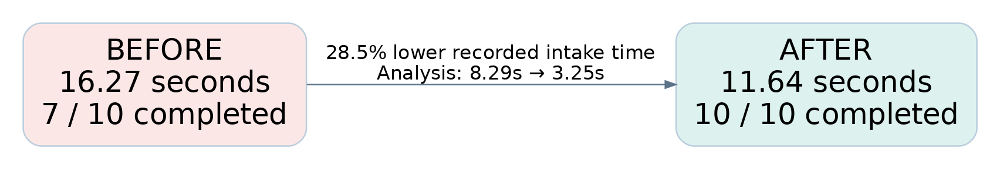
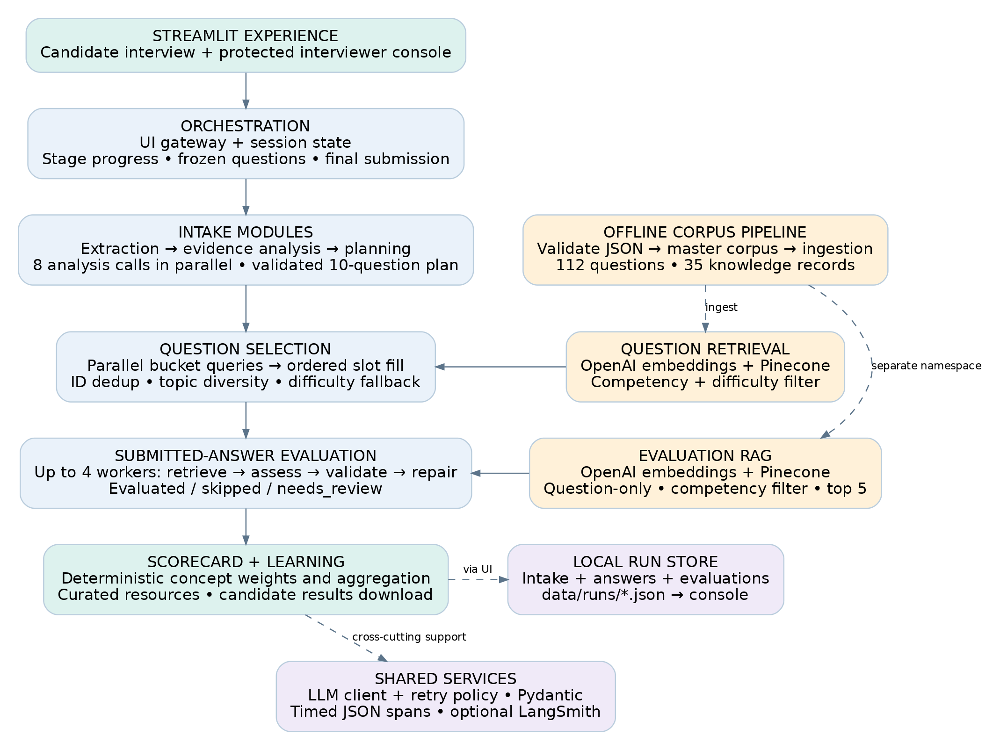
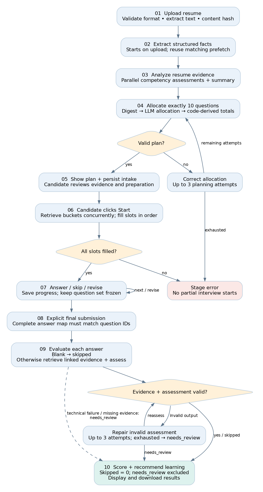

# InterviewGapAI

Implementation stages, module design and the evolution of performance

Engineering report • 12 September 2026 • Source snapshot 69c9f64

InterviewGapAI turns resume evidence into a structured practice interview, evaluates submitted answers against curated knowledge, and produces an explainable competency scorecard and learning plan. This report follows what was actually implemented and how bottlenecks were identified and reduced.

## What has been delivered

The current repository contains the complete candidate path: resume upload, extraction, evidence analysis, constrained planning, corpus-backed question selection, answer collection and revision, grounded evaluation, deterministic scoring, and curated recommendations. An interviewer console exposes recorded runs and evaluation reports.

## The engineering strategy

Use models for interpreting evidence and judging answer concepts. Keep identity, arithmetic, slot filling, score calculation and resource ordering in application code. Overlap independent network work, preserve ordered state changes, validate every handoff, and measure quality alongside latency.

## How to read the evidence

“Measured” means a saved benchmark artifact; “historical observation” means a commit message or dated change note; “implemented” means the behavior is present in source. Proposed next steps are explicitly separated. The benchmark is a small fixture study, not a production service-level guarantee.

The existing README and some module comments describe an earlier MVP and still say the application or scoring is missing. This report follows the latest code and commit history where those descriptions conflict.

## Report map

Architecture and process • Implementation timeline • Module explanations • Latency and retrieval evidence • Strategic issues and fixes • Observability and validation • Remaining bottlenecks • Source index

# 1. Architecture infographic

The application is a Streamlit host over reusable Python modules. Two retrieval paths serve different purposes: selecting interview questions and supplying evidence for answer evaluation.

Solid arrows show main data dependencies. Dashed arrows show support, ingestion or persistence. Question retrieval uses competency + difficulty; Evaluation RAG uses competency only. External dependencies are the configured LLM provider, OpenAI embeddings, Pinecone and optional LangSmith. [S2–S7]

# 2. Process-flow infographic

The interview follows a bounded workflow. Planning and evaluation can repair invalid outputs; question selection fills a fixed plan without an LLM decision loop.

Resume evidence determines what to probe, not a skill score. Evaluation begins only after explicit final submission. Review states protect the candidate from being scored zero for a technical failure. [S2–S6]

# 3. How implementation progressed

| Stage / date | What was implemented | Reason and evidence |
| --- | --- | --- |
| 1 • Sep 8
Assessment foundation | Curated questions and evaluation knowledge; master builder; golden retrieval dataset. | Stable IDs and evaluation_refs connect questions to marking evidence. 929052a, 60f8341. |
| 2 • Sep 9
Retrieval experiments | BM25, dense search, hybrid RRF and metadata-filtered experiments with saved metrics. | Compare semantic relevance, ranking and delay before selecting the runtime retrieval policy. 740fbb3. |
| 3 • Sep 10
Candidate intake | Resume extraction and evidence analysis; constrained 10-question planner; selector; runner and notebook. | Separate evidence interpretation, allocation and retrieval into validated contracts. 0af2fcb, b5276ca, 840b7e5. |
| 4 • Sep 10
Grounding and UI | Competency-filtered Evaluation RAG service; Streamlit candidate flow; shared observability. | Provide reusable evidence retrieval and make the workflow usable and traceable. 622745b, 6f908da, 08d1cf4. |
| 5 • Sep 10–11
Performance and resilience | Parallel question retrieval, progressive intake, analyzer fan-out, planner digest and repair, upload prefetch, retry policy, provider selection. | Reduce network waits, expose progress, and distinguish permanent failures from retryable conditions. a437804, 6dade8a, 105fad9. |
| 6 • Sep 11
Assessment quality | Topic redundancy handling; grounded Evaluation Agent with bounded validation/repair. | Prevent repetitive interviews and unsupported assessments. 702a3d6, 9a8a50b. |
| 7 • Sep 12
Operational feedback | Protected interviewer console, grouped reports, staged run persistence, automatic refresh and richer journey traces. | Make real uploads visible from the plan stage and retain evidence after the candidate tab closes. 44efb76 through f03c1f6. |
| 8 • Sep 12
Close the learning loop | Deterministic scorecard, resource matching, candidate scores, answer revision and results download. | Convert validated concept judgments into explainable next steps. 07f3efc, 69c9f64. |

## Why the order mattered

A curated corpus and evaluation datasets came before the complete interview experience. The system then gained measurable stage boundaries, which made targeted performance changes possible. Later work addressed operational visibility and the final learning outcome, extending the product beyond an intake demo. [S1]

# 4. Modules: corpus and intake

## Corpus preparation and contracts

competency_blueprint/ and job_description/ define the assessment scope. data/curated/ holds reviewed question and evaluation JSON. scripts/validate_corpus.py checks required fields, allowed values, duplicates and references; scripts/build_corpus.py combines validated exports. src/corpus/document_builder.py prepares retrieval documents. Ingestion scripts populate the question and evaluation namespaces. Structural validation does not establish factual correctness. [S7]

The master manifest records 112 questions and 35 evaluation records across seven competencies: RAG (31 questions), agentic AI (29), AI evaluation (17), LLM fundamentals (13), Python/software engineering (8), AI system design (8), and AI security (6). Difficulty coverage is 48 basic, 49 intermediate and 15 advanced questions. [S7]

## Upload adapter — ui/resume_upload.py

Converts PDF, DOCX, DOC, CSV and Markdown into a common upload document with extracted text, provenance, warnings and a SHA-256 hash. The hash supplies an opaque candidate ID and keys upload reuse. Legacy DOC depends on the host textutil command; scanned PDFs need OCR that is not implemented. [S2]

## Resume extraction — src/resume/extractor.py

Turns normalized text into the CandidateResume schema. This is structured fact extraction, not skill assessment. The shipped OpenAI default is gpt-5.4-mini, with a per-stage override. ui/gateway.py starts this work on upload in a bounded prefetch pool; the prepare action collects the matching future rather than sending the same extraction again. [S2, S3]

## Evidence analysis — src/resume/analyzer.py

Reads CandidateResume and returns ResumeAnalysis: an overall summary plus evidence assessments for seven competencies. Eight concurrent calls perform one summary and seven competency reviews. Each worker receives its own copied trace context; results are assembled in competency order, independent of finish order. Candidate identity and competency labels remain application-owned. Missing resume evidence is a reason to probe, not proof of weakness. [S3]

## Interview planning — src/planning/interview_planner.py

Compresses the analysis into an evidence digest: competency, evidence level, probe priority and reason. The model proposes per-competency difficulty allocations and a short rationale. Code derives totals and Pydantic enforces the 10-question contract. A maximum of three allocation attempts can show a rejected breakdown and directional arithmetic correction. The planner does not generate the actual questions. [S3]

## Schemas — src/schemas/

Pydantic models define resume facts, analysis, interview plans, selected questions, concept coverage, answer evaluation, scorecards and learning outputs. These boundaries detect malformed or inconsistent data. They cannot independently prove that a model’s interpretation is correct.

# 5. Modules: interview to learning

## Question selector — src/interview/question_selector.py

Uses dense retrieval filtered by competency and difficulty. It retrieves a ranked pool per requested bucket, overfetching five candidates beyond the slot count, and prefetches primary buckets with up to eight workers. Slot filling stays sequential so global question-ID deduplication and interview order remain stable. Corpus records supply authoritative question text, concepts and evaluation references. [S4]

The selector prefers unused sub-competencies and rejects a candidate provisionally when more than half its must-have concepts overlap an accepted question. Adjacent-difficulty fallback can fill thin pools; deferred redundant candidates are admitted only if necessary, with a warning. Any remaining unfilled slot causes the UI gateway to refuse to start a partial interview. [S4]

## Session and gateway — ui/session.py, ui/gateway.py, ui/app.py

The gateway adapts backend stages to UI progress and safe errors. The app shows the plan after stages 1–3; selection runs when Start is clicked. Session state freezes question IDs, collects answers/skips, supports revision before final submission, and requires explicit final submission. Expected concepts and internal strategy remain off the candidate interview screen. [S2]

## Evaluation RAG — src/evaluation_rag/

service.py constructs a question-only query and requests the top five knowledge records within the question’s competency. Candidate answers are excluded from retrieval so an incorrect answer cannot steer the reference search. dense_retriever.py embeds with OpenAI and searches Pinecone’s evaluation namespace; the service returns evidence ID, rank, score and content. A reusable service avoids repeatedly constructing clients. BM25 remains available for experiments. [S5]

## Evaluation Agent — src/evaluation/agent.py

Accepts exactly the frozen question-ID/answer map and evaluates with up to four question workers. Blank answers become skipped without an assessment call. A nonblank answer needs usable retrieved evidence and at least one matching curated evaluation_ref. The model judges required concepts; application validation checks complete concept coverage, supplied evidence IDs, and exact answer excerpts. Invalid assessments can be repaired within three attempts. Missing evidence, exhausted repair or technical failure leads to needs_review. [S5]

## Scoring and learning — src/scoring/, src/learning/

Concept weights are demonstrated = 1, partial = 0.5, missing = 0. A question score is 100 × earned concept weight / required concept count. Skips score zero; needs_review is excluded. Competency scores average eligible question scores; the overall score averages eligible questions rather than equally weighting competencies. Default bands are gap below 70, developing from 70 to below 85, and strong at 85 or above. Bonus concepts and misconceptions do not change the number. [S6]

recommendations.py loads a validated, cached local catalog and orders recommendations by weakest competency, with resources in curated priority order and a configured cap. A missing or invalid catalog does not suppress the scorecard. The UI exposes competency detail, learning recommendations and a Markdown results download. No model call is needed for scoring or resource ordering. [S2, S6]

# 6. Latency: what changed and what it cost

The saved intake study used five fixture resumes, repeated twice, with gpt-5.4 for every stage in both arms. Seven baseline runs and ten optimized runs completed. The report records stage and total medians independently; adding stage medians need not reproduce the total median. [S8]

| Metric | Before | After | Interpretation |
| --- | --- | --- | --- |
| Intake total, stages 1–3 | 16.27 s | 11.64 s | 28.5% lower recorded median; does not include selection or answer evaluation. |
| Resume extraction | 3.03 s | 2.80 s | Same model/call in both arms: run variance, not proof of the smaller-model benefit. |
| Resume analysis | 8.29 s | 3.25 s | 60.9% lower stage median; one large response becomes eight overlapping requests. |
| Interview planning | 4.86 s | 5.47 s | 12.5% slower observed median; success rate is the durable improvement. |
| Completed intake runs | 7 / 10 | 10 / 10 | Three baseline validation failures; no optimized failures in this fixture study. |
| Total model calls | 3 | 10 | Concurrency lowers wall time but increases requests and rate-limit exposure. |
| Total input tokens | 5,416 | 15,036 | About 2.78×; the resume context is repeated across analysis calls. |
| Total output tokens | 1,740 | 2,202.5 | About 1.27×; reduced time does not establish reduced API cost. |

## The first bottleneck: serial retrieval waits

Commit a437804 reports question selection falling from 8.95 to 3.55 seconds on candidate_14 with identical question IDs, a 60.3% decrease in that one observation. Primary retrieval queries are independent, so they run concurrently; the ordered fill consumes cached results. This historical single-candidate result is separate from the stages 1–3 benchmark and must not be added to it as one measured end-to-end gain. [S1, S4]

## The next bottleneck: long structured analysis

The largest controlled stage gain came from splitting competency analysis into independent requests. Its lower bound becomes approximately the slowest worker plus overhead. Repeated prompt input and multiple failure opportunities are the tradeoff; bounded retries recover transient failures. This is faster wall-clock execution, not less total computation. [S3, S8]

## Smaller extraction model and provider variability

The code defaults extraction to gpt-5.4-mini, but the saved comparison held extraction on gpt-5.4. The 28.5% headline therefore cannot be attributed to the smaller default model. Historical notes record overload/503 behavior on gpt-5.6 and 5.0–8.8-second trivial request samples, which motivated controlling the comparison model. These are session observations, not current provider performance claims. [S8, S9]

# 7. Retrieval: quality was also a bottleneck

Fast retrieval is useful only if the pool contains relevant, appropriate questions. The v2 reports share a 50-query set containing 45 retrieval queries and five negative queries. The figures below are saved aggregate summaries, not a new benchmark. Recall@5 measures recovery of labeled relevant questions; MRR emphasizes the first relevant hit. [S10]

| Question retriever | Recall@5 | MRR | Avg. latency (ms) |
| --- | --- | --- | --- |
| BM25 | 0.826 | 0.771 | 0.4 |
| Dense | 0.931 | 0.819 | 709.1 |
| Hybrid RRF | 0.874 | 0.830 | 758.2 |
| Dense + competency | 0.959 | 0.856 | 723.9 |
| Dense + competency + difficulty | 0.948 | 0.913 | 2223.2 |
| Dense + full metadata | 0.948 | 0.974 | 761.3 |

## What the runtime choice means

Question selection explicitly uses competency + difficulty filtering because those constraints come from the plan. Full metadata achieved stronger ranking in the stored experiment, but the runtime planner does not allocate a sub-competency for every slot. Its experimental score therefore does not automatically make it the appropriate runtime configuration. [S4, S10]

The competency + difficulty report has a higher recorded latency than the other dense variants. These independent reports do not isolate filter cost from provider/network variability. Metadata filtering should be described as a constraint and relevance decision; the stored data does not support claiming that it made each search faster.

## Why hybrid was not automatically better

Hybrid RRF combines lexical and dense rankings. In this dataset it improved MRR slightly over plain dense but reduced Recall@5 from 0.931 to 0.874 and added recorded latency. Adding retrieval components is not, by itself, evidence of a better system. The runtime selector remains filtered dense. [S10]

## Coverage, scarcity and duplicate topics

The question bank is uneven: only 15 advanced questions exist across all seven competencies. Two different IDs can test the same idea, and an exact-ID deduplication check misses that. The September 11 change added sub-competency and concept-overlap checks using already-loaded corpus data, without another retrieval or LLM call. [S4, S7, S9]

Diversity is a preference rather than an absolute rule. A distinct topic at an adjacent difficulty is preferred to a redundant question at the exact difficulty. If scarcity persists, the deferred question can be admitted with a warning; a genuinely unfillable plan is rejected. This balances coverage quality with the requirement to produce a complete interview.

## Evaluation retrieval has a different contract

Evaluation RAG searches knowledge, not questions. It uses competency-only filtering and question-only input. The Evaluation Agent additionally requires recovery of a curated linked evidence ID before assessment. Question-retrieval metrics above do not measure answer-evaluation accuracy or the separate Evaluation RAG dataset. [S5]

# 8. Strategic issues and iterative fixes

| Issue encountered | Implemented response | Effect / remaining tradeoff |
| --- | --- | --- |
| Opaque waiting in the UI | Stage progress, plan displayed after analysis/planning, question selection on Start, upload extraction prefetch. | Earlier useful feedback and overlapping upload time. Deferring selection moves waiting; it does not eliminate retrieval cost. [S2, S9] |
| Planner returned totals of 9 or 11, or contradictory summaries | Send compact evidence; derive totals in code; bounded arithmetic repair with prior counts. | Saved completion rate rises from 70% to 100%. Planner latency did not improve in the controlled report. [S3, S8] |
| Quota exhaustion looked like a slow request | Disable SDK retries for configured LLM clients; fail fast for billing/quota codes; retry transient errors. | Avoid pointless backoff. Billing availability itself needs an external fix. Embedding clients still have their own SDK behavior. [S3, S9] |
| Provider overload and response variability | OpenAI/DeepSeek client factory, per-stage model overrides, retryable structured-parse validation failures. | Provider choice is configuration, not automatic failover. OpenAI is still required for embeddings. [S3, S5, S9] |
| Alternate provider returned schema instead of data; planning arithmetic was less reliable | Retry structured parse failures and retain the planner’s bounded repair. | Historical DeepSeek notes: 7/10 within three planning attempts; follow-up six-attempt trials recovered the remaining cases. Default remains three. [S9] |
| Wrong inherited Pinecone index caused empty retrieval | UI loads repository .env with override=True; stage failures identify the failing stage/type. | Fixes the recorded environment-precedence trap; genuine corpus shortages still need fallback or corpus expansion. [S1, S2] |
| Different question IDs repeated the same topic | Local redundancy checks, deferred candidates and adjacent-difficulty fallback. | Improves topic diversity without an added model call; can relax exact difficulty or admit a repeat with a warning. [S4] |
| A fluent assessment could lack valid evidence | Linked-evidence guard; exact concepts, citation IDs and answer-excerpt validation; bounded repair. | Unsupported outputs become needs_review rather than invented scores. Validation cannot establish all semantic correctness. [S5] |

## The recurring improvement pattern

Observe a real failure or timed stage → isolate the cause → reduce unnecessary work or overlap independent calls → preserve contract checks → add focused regression coverage → compare latency and completion together. Changes were not all speed changes: planner arithmetic, diversity handling and evidence validation chiefly reduced failures or low-quality outcomes. [S1, S8, S9]

# 9. Operational visibility and verification

## Recording the candidate journey

ui/answer_store.py writes local JSON under the git-ignored data/runs/ directory. The sequence evolved from saving submitted answers to retaining all intake stages and incremental answer progress, then persisting evaluations. Runs are now created as soon as a plan is ready, so a candidate reading the plan is already visible to the interviewer. The run viewer refreshes automatically when enabled. [S1, S2]

This solves visibility across tabs and after a session ends. Storage is a file per content-derived candidate ID: later writes supersede or extend the record. It is not a transactional database or a versioned attempt history. A hash-based identifier does not make the stored resume analysis and answers anonymous.

## Traceable stages and safe errors

src/observability/core.py provides request/trace IDs, nested timed spans, structured JSON events and optional LangSmith export. Analyzer and evaluation workers explicitly copy context so their work stays attached to the parent trace. The UI configures telemetry at startup and converts backend exceptions into a stable stage-facing message. Gateway logs record the exception type instead of raw provider tracebacks. [S3, S5, S11]

General metadata sanitization removes sensitive keys and redacts recognizable identifiers; it is not a universal free-text privacy guarantee. The latest history adds question, answer and must-have-concept detail to the interviewer console’s local stage-trace view. This UI display is distinct from optional LangSmith export; the commit does not add those payloads to remote telemetry. The console therefore needs appropriate access to the persisted content. No live candidate records or credentials are reproduced in this report. [S1, S11]

## Interviewer reports and access boundary

ui/auth.py gates the interviewer console with configured shared credentials and refuses access if no password is configured. The console exposes stored candidate stages and grouped evaluation reports through ui/dashboard.py and ui/eval_reports.py. This is an MVP application gate, with no account lifecycle or lockout system. Candidate screens keep marking criteria hidden while answering. [S2]

## Verification performed for this report

On 12 September 2026, .venv/bin/python -m pytest -q reported 191 tests passed and 12 subtests passed in 3.80 seconds. The suite covers backend and UI contracts including retries, question selection, Evaluation RAG, the Evaluation Agent, scoring, learning recommendations, session state, upload, authentication and persistence. Remote LangSmith export attempted by the environment failed because network name resolution was unavailable; live provider behavior was not re-benchmarked.

A previous test-discovery gap was fixed in commit 7a0c215: unittest discovery silently omitted pytest-style tests. pyproject.toml now configures pytest to collect tests/ and ui/tests/ with the repository root on the import path. A passing offline suite validates local behavior under its fixtures and mocks, not production load or real-model accuracy. [S1, S12]

# 10. Remaining bottlenecks and next steps

The following items are recommendations inferred from the inspected implementation, not claims that these changes have already been delivered.

| Priority | Next improvement | How to establish success |
| --- | --- | --- |
| 1 • Measure the full journey | Benchmark upload-to-plan, Start-to-first-question, submission-to-results and total completion. Record cold/warm state, model, retries, tokens and concurrent users. | Compare median and p95 latency, completion rate and cost per successful interview on the same fixture set. Current intake data covers stages 1–3 only. |
| 2 • Control concurrency globally | Analysis has eight workers per resume; evaluation has up to four workers per interview. Add shared request budgets and explicit stage deadlines/cancellation if load requires them. | Load-test multiple sessions; demonstrate bounded p95 and controlled 429 rates. Per-stage worker limits do not impose a process-wide provider budget. |
| 3 • Revisit planning cost | Compare the current digest/repair planner with a deterministic allocator or smaller model, preserving evidence priorities and constraints. | Measure valid-plan completion, priority coverage, latency and token cost together. Reject a faster option that makes materially worse plans. |
| 4 • Avoid repeated retrieval work | Evaluate question-embedding or evaluation-context reuse keyed by question, embedding model, corpus/index version and filters. | Show fewer embedding/search requests without stale evidence or worse linked-evidence recovery. These cross-run caches are not implemented today. |
| 5 • Expand thin corpus pools | Add reviewed advanced questions and diverse topics, especially in small competency pools. | Track fallback frequency, redundancy warnings and unfilled slots before and after corpus changes. |
| 6 • Protect stored attempts | Introduce unique interview-attempt IDs, atomic/transactional writes and a deliberate retention/access design when moving beyond local use. | Verify simultaneous writes, crash recovery and distinct attempts for the same uploaded resume. Current same-candidate file overwrites do not preserve attempt history. |
| 7 • Validate judgment quality | Extend fixture reviews to answer-level correctness, evidence sufficiency, model comparison and scorer-policy calibration. | Compare against human-reviewed concepts; measure invalid/review rates separately from retrieval recall and latency. |

## What the project teaches

The largest demonstrated gains came from overlapping independent network work. Moving arithmetic and scoring into code reduced avoidable model failure modes and made results reproducible. Progressive screens and persistence removed experience and visibility bottlenecks. The remaining work is to quantify whole-journey performance under load while maintaining evidence quality and controlled operational cost.

# 11. Source index and reproducibility

All claims are grounded in local repository files and Git history through 69c9f64. Paths are relative to the repository root. The original benchmarks were read, not regenerated; private .env values and data/runs contents were not used as report evidence.

| Ref | Primary evidence |
| --- | --- |
| S1 | Git history: 929052a, 60f8341, 740fbb3, 0af2fcb, 622745b, b5276ca, a437804, 105fad9, 702a3d6, 9a8a50b, 7a0c215, f03c1f6, 07f3efc, 69c9f64; intervening Sep 12 persistence/UI commits. |
| S2 | ui/app.py; ui/gateway.py; ui/session.py; ui/resume_upload.py; ui/answer_store.py; ui/auth.py; ui/dashboard.py; ui/eval_reports.py. |
| S3 | src/resume/extractor.py; src/resume/analyzer.py; src/resume/analyzer_prompts.py; src/planning/interview_planner.py; src/planning/prompts.py; src/llm_client.py; src/llm_retry.py. |
| S4 | src/interview/question_selector.py; src/retrieval/metadata_filtered_dense_retriever.py; src/retrieval/dense_retriever.py; tests/test_question_selector.py. |
| S5 | src/evaluation_rag/service.py; src/evaluation_rag/dense_retriever.py; src/evaluation/agent.py; src/evaluation/prompts.py; src/schemas/answer_evaluation.py; tests/test_evaluation_agent.py. |
| S6 | src/scoring/scorecard.py; src/schemas/scorecard.py; src/learning/recommendations.py; src/schemas/learning.py; data/raw/learning_resources.json. |
| S7 | data/prepared/master/corpus_manifest.json; scripts/validate_corpus.py; scripts/build_corpus.py; scripts/ingest_pinecone.py; scripts/ingest_evaluation_pinecone.py; src/corpus/document_builder.py. |
| S8 | data/eval/intake_latency_report.json; scripts/evaluate_intake_latency.py. Report timestamp: 2026-09-11T09:24:58Z; embedded git_ref: 6dade8a. Config: five resumes × two repeats, gpt-5.4 in both arms. |
| S9 | docs/CHANGES_2026-09-11.md. Historical explanation and provider observations; raw benchmark configuration takes precedence when interpreting headline numbers. |
| S10 | data/eval/results/{bm25,dense,hybrid,dense_competency,dense_competency_difficulty,dense_metadata}_results_v2.json; scripts/evaluate_question_retrieval.py. |
| S11 | src/observability/core.py; docs/OBSERVABILITY.md; ui/app.py; commit f03c1f6. The later UI stage-trace detail is distinct from sanitized remote telemetry. |
| S12 | pyproject.toml; tests/; ui/tests/; local pytest result from 12 September 2026. |

Deliverables: editable DOCX, portable PDF, Report.md, and diagram sources in assets/. Rebuild with build_report.py and export with LibreOffice. Re-review the evidence before updating the snapshot date.
