# Candidate UI

This directory is an additive Streamlit adapter over the existing InterviewGapAI
backend. It does not modify or duplicate the contributor's resume analysis,
interview planning, question retrieval, schemas, corpus, or evaluation services.

```mermaid
flowchart LR
    U[Upload CV] --> X[UI format adapter]
    X --> E[Existing resume extractor]
    E --> A[Existing resume analyzer]
    A --> P[Existing interview planner]
    P --> Q[Existing question selector]
    Q --> I[UI interview session]
    I --> S[Final submission]
    S -. pending backend capability .-> R[Evaluation and report]
```



The UI accepts PDF, DOCX, DOC, CSV, and Markdown resumes. Legacy DOC conversion
uses the host's `textutil` command and may require the candidate to save the file
as DOCX on unsupported hosts. Scanned PDFs require OCR, which is not enabled.

Expected concepts, evaluation references, and retrieval traces remain in the
backend question contract and are never rendered during the interview. Answers
are collected one at a time and no score is shown before final submission.

The current contributor backend stops after question selection. The completion
screen therefore reports that final evaluation integration is pending instead of
displaying synthetic or fabricated scores.

## Run locally

Install the locked project dependencies and run the UI:

```bash
uv sync --locked
uv run streamlit run ui/app.py
```

Streamlit, PDF extraction, Word extraction, and the UI test dependency are
declared in the root `pyproject.toml` and resolved in `uv.lock`; there is no
second requirements source to keep synchronized.

The existing pipeline requires a repository-root `.env` containing valid OpenAI
and Pinecone configuration. `.env` remains ignored by Git.

## Test the UI boundary

```bash
uv run pytest -q ui/tests
```
